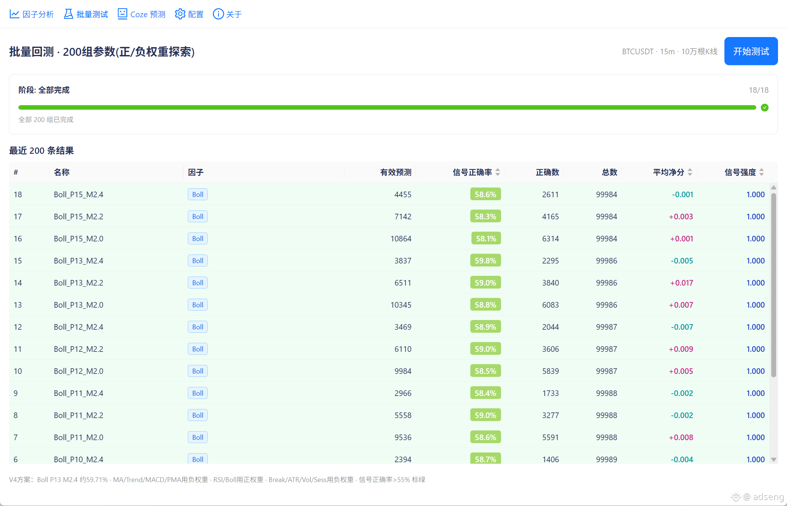
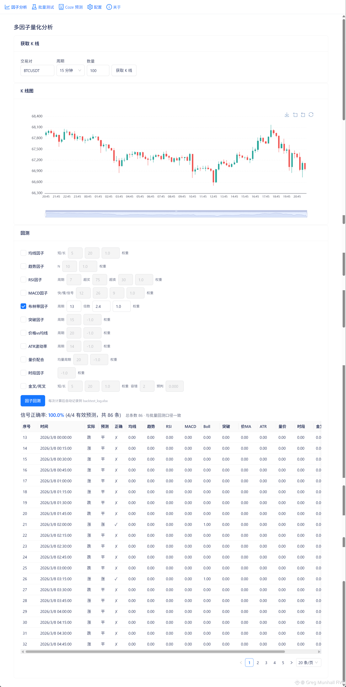
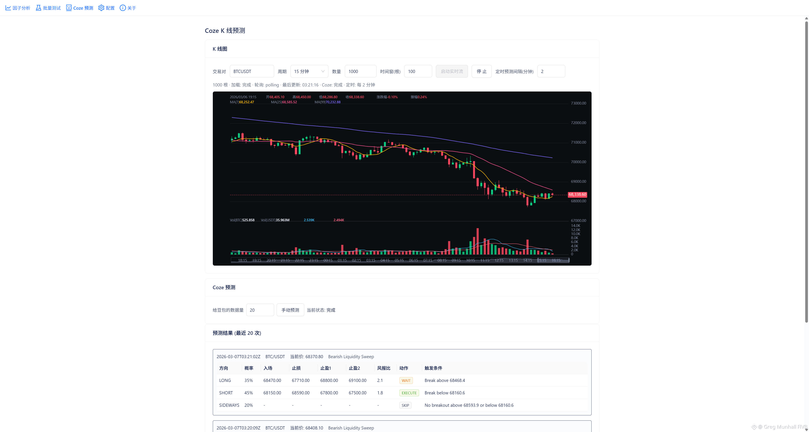

# 多因子量化分析工具

多因子技术指标量化分析工具，将各类技术指标转化为**看涨/看跌**信号，通过加权评分预测下一根 K 线方向，支持回测、批量验证与进化式自动调参。

## 研究方向

```
输入: 技术指标因子 → 每因子输出信号(0/1/-1) → 影响力 = 权重 × 信号
     → 看涨/看跌总积分 → 预测下一根K线方向 → 回测验证 + 自动调参
```

**核心假设**：多个因子的加权投票能提高方向预测的胜率。

**研究路线**：V1 全因子探索 → V3/V4 最优方向+参数网格 → V5/V6 进化算法自动调参。

## 技术方案

| 层级 | 选型 |
|------|------|
| 桌面框架 | Wails (Go + Web) |
| 前端 | TypeScript + Vite + React |
| 数据源 | Binance 正式网（历史 K 线） |
| 标的 | BTCUSDT 永续合约 15 分钟 |

## 成果概览

### 因子库（11 个已实现）

| 类别 | 因子 |
|------|------|
| 价格/趋势 | MA、Trend、Breakout、PriceVsMA、ATR |
| 成交量 | Volume |
| 技术指标 | RSI、MACD、Boll、MACross |
| 时间 | Session |

### 核心研究结论

1. **市场结构发现**：BTC 15m 是短线均值回归市场。趋势跟随因子（MA/MACD/Breakout 等）需**负权重反转**才有效，均值回归因子（Boll/RSI）按教科书方向有效。
2. **最优单因子**：布林带 Boll P13 M2.4 → **信号正确率 59.71%**（进化算法自动发现，V5/V6 两次独立运行均收敛到此参数）。
3. **因子组合帕累托前沿**：
   - 双因子：Boll + Breakout(-) → 57.2% @ 18.5% 信号率
   - 三因子：RSI7 + Boll15 + Break10(-) → 55.5% @ 32.9%（平衡型推荐）
   - 四因子：+ATR7(-) → 54.2% @ 54.1%（高频型）
4. **正确率 vs 信号率权衡**：Boll 乘数 M2.0 → 高正确率低信号；M1.2 → 信号多正确率降。帕累托前沿已明确。
5. **进化式调参有效**：V5/V6 从 58.63% 提升至 59.71%（+1.08%），收敛到 Bo13M2.4，结果可重复。

## 项目结构

```
quantitative-trading/
├── internal/
│   ├── factor/           # 11 个因子 + 回测逻辑
│   ├── batchtest/        # 批量测试用例 + 进化算法
│   ├── binance/          # 数据获取
│   ├── coze/             # Coze 智能体 K 线预测
│   ├── backtestlog/      # 回测结果 Excel 记录
│   └── config/           # .env 配置读取
├── cmd/
│   ├── fetchdata/        # 下载 K 线数据
│   ├── autotest/         # 进化式自动调参
│   ├── readexcel/        # 读取批量测试结果
│   ├── siminvest/        # 策略收益模拟
│   └── cozepredict/      # Coze 智能体预测 K 线短期走势
└── frontend/             # React UI（Wails 桌面应用）
```

## 环境要求

- **Go** 1.24+
- **Node.js** 18+（开发/构建前端时需）
- 国内访问 Binance 建议配置代理

## 配置说明

复制 `.env.example` 为 `.env.local` 或 `.env`，按需填写：

| 变量 | 说明 |
|------|------|
| `BINANCE_BASE_URL` | 币安 API 地址（默认正式网） |
| `BINANCE_PROXY` | 国内代理，如 `http://127.0.0.1:7897` |
| `BINANCE_SYMBOL` | 交易对，默认 `BTCUSDT` |
| `COZE_API_TOKEN` | Coze 智能体 Token（仅 cozepredict 需要） |
| `COZE_BOT_ID` | Coze 智能体 ID（仅 cozepredict 需要） |

K 线获取为公开接口，无需 API 密钥。Coze 相关配置仅在使用 `cozepredict` 时需要。

## 快速开始

```bash
# 1. 安装依赖
go mod download

# 2. 下载 K 线数据（国内需代理）
$env:HTTPS_PROXY="http://127.0.0.1:7897"
go run ./cmd/fetchdata

# 3. 进化式自动调参（20 轮）
go run ./cmd/autotest -n 20

# 4. 策略收益模拟
go run ./cmd/siminvest

# 5. Coze 智能体预测（需配置 COZE_API_TOKEN、COZE_BOT_ID）
go run ./cmd/cozepredict
```

## 开发与构建

```bash
# 开发模式（热重载）
wails dev

# 构建可执行文件
wails build
```

## 文档

| 文档 | 说明 |
|------|------|
| [整理plan.md](docs/整理plan.md) | V1~V6 完整测试结论、用例设计与进化算法说明 |
| [单因子回测结论](docs/单因子回测结论.md) | 单因子回测汇总 |
| [单因子MA回测结论](docs/单因子MA回测结论.md) | MA 因子专项分析 |
| [多因子回测结论](docs/多因子回测结论.md) | 多因子组合回测 |
| [coze智能体提示词](docs/coze智能体提示词.md) | Coze K 线预测提示词设计 |

## 界面预览

<table>
  <tr>
    <th>多因子回测大量数据</th>
    <th>自选多因子量化分析</th>
    <th>Coze 智能体 K 线分析</th>
  </tr>
  <tr>
    <td></td>
    <td></td>
    <td></td>
  </tr>
</table>
